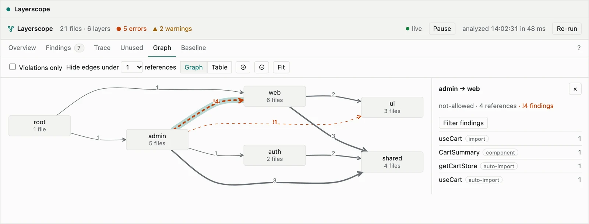

<p align="center">
  
</p>

<h1 align="center">layerscope</h1>

<p align="center">
  Layer boundary checks for Nuxt, auto-imports included.
</p>

<p align="center">
  <a href="https://www.npmjs.com/package/nuxt-layerscope"></a>
  <a href="https://github.com/hamedniroomand/nuxt-layerscope/actions/workflows/ci.yml"></a>
  <a href="https://codecov.io/gh/hamedniroomand/nuxt-layerscope"></a>
  <a href="./LICENSE"></a>
  <a href="https://layerscope.kitdev.space/"></a>
</p>

<p align="center">
  <a href="https://layerscope.kitdev.space/guide/devtools">
    <picture>
      <source media="(prefers-color-scheme: dark)" srcset="./packages/docs/public/devtools/hero-dark.webp">
      
    </picture>
  </a>
  <br>
  <sub>The Layerscope tab in Nuxt DevTools shows every finding, the layer graph and where each symbol is used.<br>It updates when you save a file.<br>
  <a href="https://layerscope.netlify.app/__layerscope/">Open the live demo</a>.</sub>
</p>

---

A component in `admin` that calls an auto-imported composable from `web` has no `import`
statement, so import-based boundary tools never see it. layerscope resolves auto-imports,
components, Nitro server utils and regular imports the same way Nuxt does, and fails CI when a
layer uses something it isn't allowed to.

- Works with Nuxt 3 and 4, local, npm and remote layers
- Checks the app, `server/` and `shared/`
- `init` writes a starter config, and each finding comes with a suggested fix
- Cycle detection, presets and a drift report that shows what a pull request adds and fixes
- Baselines for existing projects and a GitHub Action for CI
- `why`, `graph` and `unused` commands, an ESLint plugin and a DevTools tab

## Quick start

```bash
npx nuxi module add nuxt-layerscope --dev
```

```ts
// nuxt.config.ts
export default defineNuxtConfig({
  modules: ['nuxt-layerscope'],
  layerscope: {
    layers: {
      shared: { allow: [] },
      shop: { allow: ['shared'] },
      admin: { allow: ['shared'] },
    },
  },
});
```

```bash
npx layerscope check --prepare
```

Read the [getting started guide](https://layerscope.kitdev.space/guide/getting-started)
for the full setup. To see a working project first, try the [example project](https://github.com/hamedniroomand/nuxt-layerscope/tree/main/examples/shop) ([open it in StackBlitz](https://stackblitz.com/github/hamedniroomand/nuxt-layerscope/tree/main/examples/shop)).

## Documentation

Everything else lives at **[layerscope.kitdev.space](https://layerscope.kitdev.space/)**:
[CLI](https://layerscope.kitdev.space/reference/cli),
[config](https://layerscope.kitdev.space/reference/config),
[rules](https://layerscope.kitdev.space/reference/rules),
[CI](https://layerscope.kitdev.space/guide/ci) and
[troubleshooting](https://layerscope.kitdev.space/guide/troubleshooting).

Using a coding assistant? See [Coding assistants](https://layerscope.kitdev.space/guide/coding-tools)
and [`llms.txt`](https://layerscope.kitdev.space/llms.txt).

## Contributing

Bug reports and pull requests are welcome. See [CONTRIBUTING.md](./CONTRIBUTING.md) to get set up.

## License

[MIT](./LICENSE) © Hamed Niroomand
