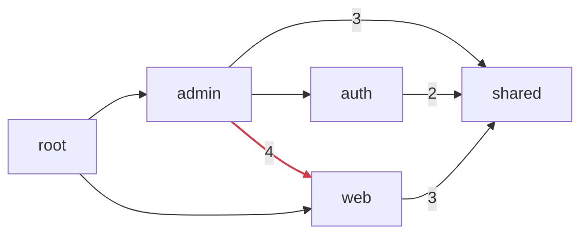

# Explore dependencies

`layerscope check` tells you what is wrong. Three more commands help you understand the codebase
before you change it: `why` traces one symbol, `graph` draws the whole picture, and `unused` finds
what nothing depends on.

## Trace a symbol with `why`

When a finding surprises you, or before you move a composable to another layer, ask where it is
used:

```bash
npx layerscope why useCart
```

```text
useCart → layers/web/app/composables/useCart.ts (web)
  layers/admin/app/components/AdminPanel.vue:2:14   admin → web   ✖ not allowed
  layers/web/app/components/CartSummary.vue:3:14    web → web     ✔ same layer
```

`why` accepts:

- **auto-imports**, such as `useCart`, `formatPrice` or `defineEventHandler`,
- **components**, where `BaseButton`, `base-button` and `LazyBaseButton` name the same one,
- **import specifiers**, exactly as written: `#layers/web/app/composables/useCart`,
  `~/utils/format` or a relative path.

Each use gets a status:

| Status           | Meaning                                                  |
| ---------------- | -------------------------------------------------------- |
| `✔ same layer`   | Used inside the layer that owns it.                      |
| `✔ external`     | Resolves to a package or virtual module, not to a layer. |
| `✔ unrestricted` | The using layer has no `allow` list.                     |
| `✔ allowed`      | The using layer lists the target layer in `allow`.       |
| `✖ not allowed`  | A boundary violation. `layerscope check` reports it.     |

If a name resolves to different files in different contexts, for example a `useDb` server util
and an app composable with the same name, each target is listed on its own.

## Draw the graph

```bash
npx layerscope graph > layers.mmd
```

The default output is a [Mermaid](https://mermaid.js.org) flowchart of your layers. Paste it into
a pull request description or a Markdown doc and GitHub renders it:



An arrow means "depends on", a number is how many references it carries, and red arrows break
your rules. Packages are left out.

For a file-level view, grouped by layer, and for Graphviz:

```bash
npx layerscope graph --by file --format dot | dot -Tsvg > files.svg
npx layerscope graph --format json > graph.json
```

## Find unused code

```bash
npx layerscope unused
```

```text
web
  CartBadge      layers/web/app/components/CartBadge.vue        component
admin
  useAdminStats  layers/admin/app/composables/useAdminStats.ts  auto-import (app)
  exportCsv      layers/admin/app/utils/exportCsv.ts            auto-import (app)

3 unused symbols in 2 layers
```

`unused` lists components, composables, utils and server utils that are registered by one of your
layers and referenced nowhere. A few rules keep it honest:

- An explicit import of a file counts as using everything the file exports.
- If any file renders a component chosen at runtime (`<component :is>` bound to a value, or
  `resolveComponent(name)`), unused components are marked **possibly used at runtime**, because
  layerscope cannot see which one is picked.
- Layers installed from npm or git are not checked. They are dependencies, and their unused code
  is not yours to delete.

Treat the list as a starting point for review, not a delete list. Code used only by tests, by a
plugin registered at runtime, or by another app that extends this one looks unused too.

## Options

All three commands take `--config`, `--prepare`, `--source` and `--verbose`, like `check`.

| Command  | Formats                            | Exit code                                  |
| -------- | ---------------------------------- | ------------------------------------------ |
| `why`    | `text` (default), `json`           | `0` when the symbol is used, `2` otherwise |
| `graph`  | `mermaid` (default), `dot`, `json` | `0`                                        |
| `unused` | `text` (default), `json`           | `0`                                        |

See the [CLI reference](../reference/cli) for every option.
