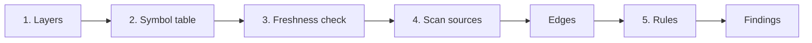

# How it works

A run has five steps: find the layers, load the symbol table, check it is fresh, scan the source
files, and apply the rules.

How long a run takes is on the [performance](./performance) page.

## 1. Layers

With the [Nuxt module](./nuxt-module), layers come from the registry it wrote: Nuxt's `_layers`
in priority order with the directories from `getLayerDirectories()`.

Without the module, layerscope loads the project's own `@nuxt/kit` (the one Nuxt installed, so
defaults match your Nuxt version) and calls `loadNuxtConfig()` and `getLayerDirectories()`. If
kit cannot be loaded, layers can still be declared with [`path`](../reference/config#layers) in
the config.

Layer names and ownership are described in [Layers](./layers).

## 2. The symbol table

The symbol table maps every name Nuxt auto-imports to where it comes from, per context:

- **components**: `BaseButton` and `LazyBaseButton` → `layers/shared/app/components/BaseButton.vue`
- **app imports**: `useCart` → `layers/web/app/composables/useCart.ts`, `ref` → `vue`
- **server imports**: `useDb` → `layers/shared/server/utils/db.ts`, `defineEventHandler` → `h3`
- **shared imports**: what both app and server code can use

It comes from one of two sources:

| Source     | Read from                                                                                                                                                      |
| ---------- | -------------------------------------------------------------------------------------------------------------------------------------------------------------- |
| `registry` | `.nuxt/layerscope/registry.json`, written by the Nuxt module from Nuxt's hooks                                                                                 |
| `types`    | `.nuxt/components.d.ts` (or `.nuxt/types/components.d.ts`), `.nuxt/types/imports.d.ts`, `.nuxt/types/nitro-imports.d.ts` and `.nuxt/types/shared-imports.d.ts` |

By default the registry is used when it exists. Both produce the same boundary findings; the
registry also knows overridden components. On Nuxt 3, which writes no `shared-imports.d.ts`, the
`types` source gives shared code the imports that app and server have in common, which is the
rule Nuxt 4 uses.

## 3. Freshness

Generated files are only correct if they were written after the last change to your layers.
layerscope stops with exit code `2` when they are clearly stale:

- a component or auto-import points at a file that no longer exists, or
- a component file exists that Nuxt has not registered. With the registry, every component dir
  Nuxt scanned is compared with the files recorded when it was written; with the `types` source
  the default `components/` dirs are checked (overridden and island components are expected to be
  missing there).

File modification times are not used: Nuxt skips rewriting unchanged files, so they would
report stale files that are not.

## 4. Scanning

Every source file of every checked layer is parsed:

- **Scripts** (`.ts`, `.js`, `.tsx`, `.jsx`, `.mts`, `.cts`, `.mjs`, `.cjs`, and `<script>` blocks of
  `.vue` files) are parsed with [oxc-parser](https://oxc.rs) and scope-tracked. An identifier that is not
  declared, imported or a known global is a _free_ identifier: it is either auto-imported or
  unresolved. A local `const useCart = ...` shadows the auto-import of the same name, just as it
  does at runtime.
- **Templates** are compiled with `@vue/compiler-sfc`, the compiler Vue uses. The render function
  shows which components Nuxt resolves (`resolveComponent("CartSummary")`) and which identifiers
  the template reads from the component instance (`_ctx.formatPrice`). `<component :is>` bound to
  a runtime value cannot be resolved and is reported.
- **Imports** are resolved like the bundler does: relative paths, Nuxt's aliases (`~`, `@`,
  `#layers/...`, and your own, read from the generated `tsconfig`), `.js` → `.ts`, and
  `index` files. `#imports` and `#components` are resolved by name through the symbol table.

Each reference becomes an **edge**: from a file and its layer to a target file and its layer, or
to a package. Only the first use of a symbol in a file is kept.

## 5. Rules

The rules look at the edges and the registry:

- [`layer-boundary`](../reference/rules#layer-boundary) reports edges into a layer that is not
  allowed.
- [`unresolved-reference`](../reference/rules#unresolved-reference) reports references that could
  not be resolved, so layerscope never calls them safe.
- [`shadowed-component`](../reference/rules#shadowed-component) reports overridden components.

Findings are sorted by file, line, column, rule and symbol, so reports are deterministic.
