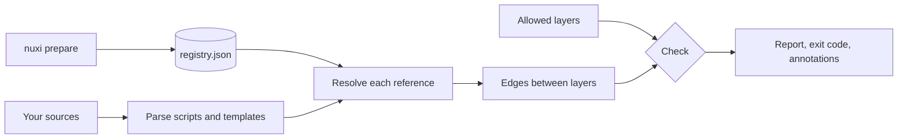

```bash
npx nuxi module add nuxt-layerscope --dev
npx layerscope check --prepare
```

## See it while you code

In development, the Nuxt module adds a tab to Nuxt DevTools. It shows every finding, the layer
graph and where each symbol is used, and it updates when you save a file.
[Open the DevTools guide](/guide/devtools).

<Screenshot
  name="overview"
  alt="The Layerscope tab in Nuxt DevTools: the Overview view with 2 errors and 3 warnings in 5 layers, a small layer graph and the files with findings."
/>

## The dependencies nobody imports

In a Nuxt layer, most dependencies never appear as an `import`. The admin layer below uses a
composable and a component from the web layer, and nothing in the file says so. Tools that read
import statements see a clean file.

```vue [layers/admin/app/components/AdminPanel.vue]
<script setup lang="ts">
  const cart = useCart(); // from layers/web
</script>

<template>
  <CartSummary :cart="cart" />
  <!-- also from layers/web -->
</template>
```

layerscope sees both:

```text
layers/admin/app/components/AdminPanel.vue
  2:16    error  Auto-import "useCart" crosses from layer "admin" into "web"  layer-boundary
                 useCart → layers/web/app/composables/useCart.ts
                 allowed for "admin": shared, auth
  6:3     error  Component <CartSummary> crosses from layer "admin" into "web"  layer-boundary
                 CartSummary → layers/web/app/components/CartSummary.vue
                 allowed for "admin": shared, auth

✖ 2 problems (2 errors, 0 warnings)
```

## What it checks

<CardGroup :cols="2">

<Card title="Auto-imported composables and utils" icon="braces">

`useCart()` in a script or <code v-pre>{{ formatPrice(total) }}</code> in a template, resolved to the file and
layer Nuxt picked.

</Card>

<Card title="Components" icon="component">

`<CartSummary>`, `<cart-summary>` and `<LazyCartSummary>`, including components one layer
overrides in another.

</Card>

<Card title="Server and shared code" icon="server">

Nitro utils in `server/`, and the auto-imports available in `shared/`, each in its own context.

</Card>

<Card title="Explicit imports" icon="code">

`#layers/web/…`, `~/…`, relative paths, `#imports` and `#components`, through Nuxt's own alias
map.

</Card>

</CardGroup>

## Made for teams with a real codebase

<CardGroup :cols="3">

<Card title="A CI gate" icon="git-pull-request" to="/guide/ci">

Exit codes, inline annotations on the pull request and a GitHub Action.

</Card>

<Card title="A baseline" icon="archive" to="/guide/baseline">

Accept the violations you have today. Only new ones fail the build.

</Card>

<Card title="A starting point" icon="rocket" to="/guide/getting-started#generate-a-starting-config">

`layerscope init` reads your layers and writes a config that passes today, and every finding comes
with a suggested fix.

</Card>

<Card title="Configured in nuxt.config" icon="settings" to="/reference/config">

Layers and rules sit next to the rest of your Nuxt config.

</Card>

<Card title="Editor feedback" icon="code" to="/guide/editor">

An ESLint and oxlint plugin reports the same findings as you type.

</Card>

<Card title="DevTools tab" icon="app-window" to="/guide/devtools">

See every layer, its allowed dependencies and current findings while `nuxi dev` runs.

</Card>

<Card title="Graphs and dead code" icon="network" to="/guide/explore">

Draw the layer graph, trace a symbol with `why`, or list what nothing uses.

</Card>

</CardGroup>

## How it works

The Nuxt module records what Nuxt resolved while it prepares your app. The CLI parses your
sources, turns every reference into an edge between two layers, and checks the edges against the
layers you allowed.



<ReadMore to="/guide/getting-started" title="Set it up in five minutes" />
